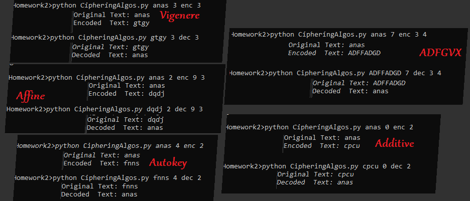

# Ciphering Algorithms
Accumulative homework assignments for the Information Security course during my time in Uni.
Today marks the 5th anniversary for this little project!
Here are some samples of usage and output:

# Usage
After installing and navigating to the installation directory, one can simply run this:

`python CipheringAlgos.py PLAIN_TEXT ALGORITHM_INDEX OPERATION_CODE KEY [OPTIONAL_PARAMETER]`

1- **PLAIN_TEXT** a string of your choosing.

2- **ALGORITHM_INDEX** one of:
- 0 : Additive Cipher
- 1 : Multiplicative Cipher
- 2 : Affine Cipher
- 3 : Vigenere Cipher
- 4 : AutoKey Cipher
- 5 : Hill Cipher
- 6 : Playfair Cipher
- 7 : ADFGVX Cipher

3- **OPERATION_CODE** either `enc` or `dec` for encode and decode respectively.

4- **KEY** an integer key.

Affine takes 2 integer keys.
Playfair takes a string key (and an optional second parameter to either use j, or i in processing).
ADFGVX require 2 keys(strings but integers also work because in the end they are mapped to their numerical order in the alphabet)

5- **[OPTIONAL_PARAMETER]**
Can be the optional parameter for Playfair or the second key for Affine/ADFGVX as explained in the previous section.
